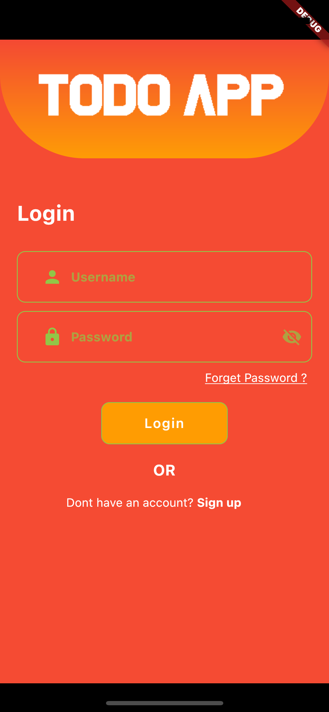
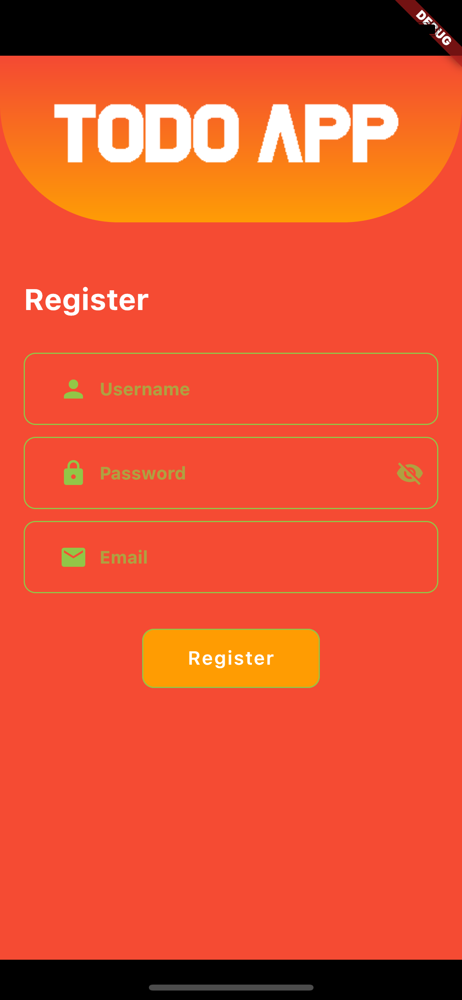

# Todo List App

## Description
Graduation work for bachelor degree in Computer Engineering course at Çukurova University.  

Basic to-do list application developed for the Android and iOS operating systems. Uses the own API that is developed with Flask and running on Heroku. As
product database uses MongoDB which is running on MongoDB Atlas. The concept of UX is used for the interface, in order to be intuitive
and easily understandable to any user.
 
 
To use the app or modify it, it is necessary to have technologies that are used in app development in your development environment. You can check them in the 'Technologies Used' section.
 
 

## Technologies Used

The following technologies were used to develop this application:

Operational System: iOS v13.7  
IDE: Visual Studio Code v1.68 (May 2022)  

Technologies:
- Python 3.10 (Flask)
- Flutter 3.0.0
- JSON Web Token
- JSON
- MongoDB

## Screenshots

## References

https://www.mongodb.com/what-is-mongodb/features  
https://pythonbasics.org/what-is-flask-python/  
https://docs.flutter.dev/  
https://flask-jwt-extended.readthedocs.io/en/stable/  
https://pymongo.readthedocs.io/en/stable/  
https://werkzeug.palletsprojects.com/en/2.1.x/  
https://pypi.org/project/validator/  
https://www.postman.com/product/what-is-postman/  
https://www.heroku.com/what  
https://www.dripcoding.com/json-to-dart/  
